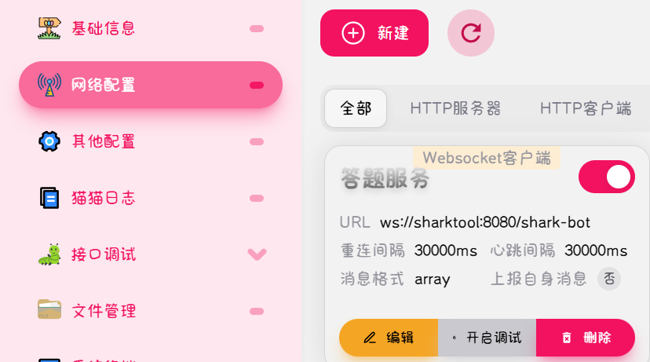

# 评估、考试自动完成！！
"cqzuxia.com"评估系统答题、考试等任务自动完成（非脚本），SpirngBoot+Vue+MybatisPlus+Redis等技术集成一体化服务平台

项目前身：https://github.com/smile-shark/answer-school-project

Docker镜像：https://hub.docker.com/r/smilesharklx/sharktool

> ### 项目介绍
>
> 1. **自动化答题与考试**：通过技术手段实现评估系统中的答题和考试任务的自动完成，减少人工操作，提高效率。
> 2. **技术集成一体化**：整合Spring Boot、Vue、Mybatis-Plus、Redis等主流技术，构建一个稳定、高效的后端服务和友好的前端界面，实现前后端的无缝对接。
> 3. **高频数据存储与事务锁处理**：利用Redis作为中间库，有效处理高频数据存储和事务锁，确保系统的高并发性能和数据一致性。
> 4. **用户互动与身份验证**：通过NapCat创建的QQ机器人，实现用户互动和登录时的身份验证，提升用户体验和系统安全性。
> 5. **代码维护与项目完整性**：相比之前的Python脚本核心方式，采用Java为核心语言，提高代码的可维护性和项目的完整性，便于后续的开发和扩展。

> ### 第三方技术支持
>
> NapCat：https://github.com/NapNeko/NapCat-Docker

### 部署方式

#### 一键部署

```bash
docker-compose up -d # 旧版本docker
docker compose up -d # 新版本docker
```

**注意点：**

* 部署时修改`docker-compose.yml`中的`QQ_GROUP_ID` 为你自己的QQ群号

* 数据库初始化可能需要一定时间，部署后第一时间不一定能用，初始化时间取决于电脑时间

* 数据库中管理员账号和密码在`./mysql/init.sql`文件的最后面，可以修改默认是

  ```text
  账号：AdminIsSmileShark
  密码：simple_password
  ```

* 数据库远程连接账号`./mysql/init.sql`文件的最后面，可以修改默认是

  ```text
  账号：sharktool
  密码：sharktool
  ```

* docker-compose.yml默认配置可以修改：

  ```yml
  services:
  
    mysql:
      image: mysql:8.0
      container_name: sharktool-mysql
      environment:
        MYSQL_ROOT_PASSWORD: sharktool  # 数据库root密码
        MYSQL_DATABASE: school_question_data  # 数据库名
        MYSQL_USER: sharktool  # 用户名
        MYSQL_PASSWORD: sharktool  # 密码
      volumes:
        - ./mysql_data:/var/lib/mysql
        - ./mysql/initdb.d:/docker-entrypoint-initdb.d  # 挂载初始化脚本目录
      ports:
        - "11407:3306"
      restart: always
      networks:
        - sharktool-network
  
    redis:
      image: redis:latest
      container_name: sharktool-redis
      ports:
        - "11408:6379"
      command: ["--appendonly", "yes", "--requirepass", "sharktool"]
      networks:
        - sharktool-network
      restart: always
  
    
    napcat:
      environment:
          - NAPCAT_UID=1000
          - NAPCAT_GID=1000
      ports:
          - 3000:3000
          - 3001:3001
          - 6099:6099
      container_name: sharktool-napcat
      restart: always
      image: mlikiowa/napcat-docker:latest
      networks:
        - sharktool-network
  
    sharktool:
      environment:
        - MYSQL_ADDRESS=sharktool-mysql:3306  # mysql地址
        - MYSQL_USERNAME=sharktool  # mysql用户名
        - MYSQL_PASSWORD=sharktool  # mysql密码
        - REDIS_ADDRESS=sharktool-redis  # redis地址
        - REDIS_PORT=6379  # redis端口
        - REDIS_PASSWORD=sharktool  # redis密码
        - QQ_GROUP_ID=QQ群号  # QQ群号
      ports:
        - 18080:8080
      container_name: sharktool
      restart: always
      image: smilesharklx/sharktool:2.1.0
      networks:
        - sharktool-network
        
  networks:
    sharktool-network:
      driver: bridge
  ```

#### 单独部署

```bash
docker run -d \
-e MYSQL_ADDRESS=sharktool-mysql:3306  # mysql地址
-e MYSQL_USERNAME=sharktool  # mysql用户名
-e MYSQL_PASSWORD=sharktool  # mysql密码
-e REDIS_ADDRESS=sharktool-redis  # redis地址
-e REDIS_PORT=6379  # redis端口
-e REDIS_PASSWORD=sharktool  # redis密码
-e QQ_GROUP_ID=QQ群号  # QQ群号
--name sharktool
--restart=always
smilesharklx/sharktool:2.1.0
```

### QQ机器人连接配置

访问NapCat控制台：http://< host >:6099

默认的token是：napcat

登录后在控制台的网络配置中添加这样的配置：

1. 网络配置
2. 新建
3. Websocket客户端
4. URL输入：`ws://sharktool:8080/shark-bot`
5. 启用


