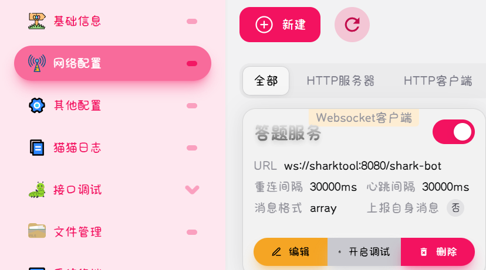

# 评估、考试自动完成！！
"cqzuxia.com"评估系统答题、考试等任务自动完成（非脚本），SpirngBoot+Vue+MybatisPlus+Redis等技术集成一体化服务平台

项目前身：https://github.com/smile-shark/answer-school-project

Docker镜像：https://hub.docker.com/r/smilesharklx/sharktool

> ### 项目介绍
>
> 1. **自动化答题与考试**：通过技术手段实现评估系统中的答题和考试任务的自动完成，减少人工操作，提高效率。
> 2. **技术集成一体化**：整合Spring Boot、Vue、Mybatis-Plus、Redis等主流技术，构建一个稳定、高效的后端服务和友好的前端界面，实现前后端的无缝对接。
> 3. **高频数据存储与事务锁处理**：利用Redis作为中间库，有效处理高频数据存储和事务锁，确保系统的高并发性能和数据一致性。
> 4. **用户互动与身份验证**：通过NapCat创建的QQ机器人，实现用户互动和登录时的身份验证，提升用户体验和系统安全性。
> 5. **代码维护与项目完整性**：相比之前的Python脚本核心方式，采用Java为核心语言，提高代码的可维护性和项目的完整性，便于后续的开发和扩展。

> ### 第三方技术支持
>
> NapCat：https://github.com/NapNeko/NapCat-Docker

### 配置文件

> 配置文件因为隐私问题没有上传

```yaml
docker:
  mysql-address: ${MYSQL_ADDRESS:localhost:3306}
  mysql-username: ${MYSQL_USERNAME:root}
  mysql-password: ${MYSQL_PASSWORD:123456}
  redis-host: ${REDIS_ADDRESS:localhost}
  redis-port: ${REDIS_PORT:6380}
  redis-password: ${REDIS_PASSWORD:123456}
  qq-group-id: ${QQ_GROUP_ID:对应的qq群号}
  ai-key: ${AI_KEY:你的key}
  ai-url: ${AI_URL:你的ai接口}
  ai-model: ${AI_MODEL:你想要的模型}
spring:
  application:
    name: AnswerQuestionServerChild
  web:
    resources:
      static-locations: classpath:/static/
  datasource:
    url: jdbc:mysql://${docker.mysql-address}/school_question_data?useSSL=false&serverTimezone=UTC&characterEncoding=utf8&allowPublicKeyRetrieval=true
    username: ${docker.mysql-username:root}
    password: ${docker.mysql-password:123456}
    driver-class-name: com.mysql.cj.jdbc.Driver
  data:
    redis:
      host: ${docker.redis-host}
      port: ${docker.redis-port}
      database: 0
      password: ${docker.redis-password}
      lettuce:
        pool:
          max-active: 8 # 最大连接
          max-idle: 8 # 最大空闲
          min-idle: 0 # 最小空闲
          max-wait: 100 # 最大等待时间(毫秒)
  ai:
    openai:
      api-key: ${docker.ai-key}
      chat:
        options:
          model: ${docker.ai-model}
      base-url: ${docker.ai-url}
server:
  port: 8080
shiro:
  ws:
    server:
      enable: true
      url: "/shark-bot"
  interceptor: com.smileShark.robot.interceptor.BotInterceptor
rebot:
  handler-groups: ${docker.qq-group-id} # 监听的群号
mybatis-plus:
  configuration:
    map-underscore-to-camel-case: true # 驼峰命名规则
#    log-impl: org.apache.ibatis.logging.stdout.StdOutImpl # 打印sql日志
  mapper-locations: classpath*:mapper/*.xml # 扫描mapper xml文件
  type-aliases-package: com.smileshark.entity # 别名包
springdoc:
  api-docs:
    enabled: true # 开启swagger文档
    path: /v3/api-docs # 配置swagger文档的数据访问路径
  swagger-ui:
    path: /swagger-ui.html # 访问swagger文档的路径
mysql:
  data:
    split:
      string: LBT_1534_LX_5212_WZL_4818
school:
  times:
    STUDENT_EXAM_MAX_TIMES: 3
  url:
    STUDENT_LOGIN_URL: https://ai.cqzuxia.com/connect/token
    STUDENT_INFO_URL: https://ai.cqzuxia.com/education/api/Student/GetStudentInfo
    STUDENT_HAVE_COURSE_URL: https://ai.cqzuxia.com/evaluation/api/stuevaluatereport/GetCourseProgram
    STUDENT_GET_COURSE_INFO_URL: https://ai.cqzuxia.com/evaluation/api/studentevaluate/GetCourseInfoByCourseId
    STUDENT_SUBSECTION_EXAM_START_URL: https://ai.cqzuxia.com/evaluation/api/studentevaluate/beginevaluate
    STUDENT_SUBSECTION_ANSWER_QUESTION_URL: https://ai.cqzuxia.com/evaluation/api/StudentEvaluate/SaveEvaluateAnswer
    STUDENT_SUBSECTION_EXAM_END_URL: https://ai.cqzuxia.com/evaluation/api/StudentEvaluate/SaveTestMemberInfo
    STUDENT_MISTAKES_URL: https://ai.cqzuxia.com/evaluation/api/StuCenter/GetFaultQuestionList
    STUDENT_SING_IN_URL: https://ai.cqzuxia.com/growing/api/StuTask/SaveStuDailyAssignment

    TEACHER_LOGIN_URL: https://zxsz.cqzuxia.com/connect/token
    TEACHER_INFO_URL: https://zxsz.cqzuxia.com/teacherCertifiApi/api/TeacherCenter/GetTeacherInfo
    TEACHER_TEST_EXAM_START_URL: https://zxsz.cqzuxia.com/teacherCertifiApi/api/TeacherCourseEvaluate/GetTeacherCourseExamInfoByCourseID
    TEACHER_TEST_EXAM_ANSWER_QUESTION_URL: https://zxsz.cqzuxia.com/teacherCertifiApi/api/TeacherCourseEvaluate/SaveTeacherCourseExamQuestion
    TEACHER_TEST_EXAM_END_URL: https://zxsz.cqzuxia.com/teacherCertifiApi/api/TeacherCourseEvaluate/SaveTeacherCourseExamInfo
    TEACHER_PASS_SUBSECTION_EXAM_URL: https://zxsz.cqzuxia.com/teacherCertifiApi/api/TeacherCourseEvaluate/GetTeacherCourseEvaluateCompleteTree
    TEACHER_SUBSECTION_EXAM_START_URL: https://zxsz.cqzuxia.com/teacherCertifiApi/api/TeacherCourseEvaluate/GetQuesionListByKPId
    TEACHER_SUBSECTION_EXAM_END_URL: https://zxsz.cqzuxia.com/teacherCertifiApi/api/TeacherCourseEvaluate/SaveTeacherCourseEvaluateInfo
    TEACHER_TEST_EXAM_RECORD_URL: https://zxsz.cqzuxia.com/teacherCertifiApi/api/TeacherCourseEvaluate/GetTeacherCourseExamRecordList
    TEACHER_TEST_EXAM_FINISH_INFO_URL: https://zxsz.cqzuxia.com/teacherCertifiApi/api/TeacherCourseEvaluate/GetQuestionListByTeacherCourseExamID
    TEACHER_COURSE_LIST_URL: https://zxsz.cqzuxia.com/teacherCertifiApi/api/CourseChapter/GetLessonListByCondition

  params:
    STUDENT_CLIENT_ID: 43215cdff2d5407f8af074d2d7e589ee
    STUDENT_CLIENT_SECRET: DBqEL1YfBmKgT9O491J1YnYoq84lYtB/LwMabAS2JEqa8I+r3z1VrDqymjisqJn3
    TEACHER_CLIENT_ID: c12abe723eda4b66af77015f2b572440
    TEACHER_CLIENT_SECRET: yHpq/AII2pBeUrUlSeMZhEs84gxSfQ/y+PyGBOmI6dh33EK6Za1VwHwz7uRRifUC
    MISTAKES_MAX_COUNT: 2000
another:
  url:
    EARLY_PAPER_URL: https://bpi.icodeq.com/163news
  redis-key:
   search-course: searchCourse
   search-chapter: searchChapter
   search-subsection: searchSubsection
   message-interceptor: messageInterceptor
   verify-code: verifyCode:code

key:
  token:
    key: smileshark&${mysql.data.split.string}
    expiration-time: 43200

```


### 部署方式

#### 一键部署

**填写配置**

`docker-compose.yml `文件中

```yaml
      - QQ_GROUP_ID=  # QQ群号
      - AI_KEY=  # AI 密钥
      - AI_URL=  # AI 地址
      - AI_MODEL=  # AI 模型
```

```bash
docker-compose up -d # 旧版本docker
docker compose up -d # 新版本docker
```

**注意点：**

* 部署时修改`docker-compose.yml`中的`QQ_GROUP_ID` 为你自己的QQ群号

* 数据库初始化可能需要一定时间，部署后第一时间不一定能用，初始化时间取决于电脑时间

* 数据库中管理员账号和密码在`./mysql/init.sql`文件的最后面，可以修改默认是

  ```text
  账号：AdminIsSmileShark
  密码：simple_password
  ```

* 数据库远程连接账号`./mysql/init.sql`文件的最后面，可以修改默认是

  ```text
  账号：sharktool
  密码：sharktool
  ```

* docker-compose.yml默认配置可以修改：

  ```yml
  services:
  
    mysql:
      image: mysql:8.0
      container_name: sharktool-mysql
      environment:
        MYSQL_ROOT_PASSWORD: sharktool  # 数据库root密码
        MYSQL_DATABASE: school_question_data  # 数据库名
        MYSQL_USER: sharktool  # 用户名
        MYSQL_PASSWORD: sharktool  # 密码
      volumes:
        - ./mysql_data:/var/lib/mysql
        - ./mysql/initdb.d:/docker-entrypoint-initdb.d  # 挂载初始化脚本目录
      ports:
        - "11407:3306"
      restart: always
      networks:
        - sharktool-network
  
    redis:
      image: redis:latest
      container_name: sharktool-redis
      ports:
        - "11408:6379"
      command: ["--appendonly", "yes", "--requirepass", "sharktool"]
      networks:
        - sharktool-network
      restart: always
  
    
    napcat:
      environment:
          - NAPCAT_UID=1000
          - NAPCAT_GID=1000
      ports:
          - 3000:3000
          - 3001:3001
          - 6099:6099
      container_name: sharktool-napcat
      restart: always
      image: mlikiowa/napcat-docker:latest
      networks:
        - sharktool-network
  
    sharktool:
      environment:
        - MYSQL_ADDRESS=sharktool-mysql:3306  # mysql地址
        - MYSQL_USERNAME=sharktool  # mysql用户名
        - MYSQL_PASSWORD=sharktool  # mysql密码
        - REDIS_ADDRESS=sharktool-redis  # redis地址
        - REDIS_PORT=6379  # redis端口
        - REDIS_PASSWORD=sharktool  # redis密码
        - QQ_GROUP_ID=  # QQ群号
        - AI_KEY=  # AI 密钥
        - AI_URL=  # AI 地址
        - AI_MODEL=  # AI 模型
      ports:
        - 18080:8080
      container_name: sharktool
      restart: always
      image: smilesharklx/sharktool:3.4.1
      networks:
        - sharktool-network
        
  networks:
    sharktool-network:
      driver: bridge
  ```

#### 单独部署

```bash
docker run -d \
-e MYSQL_ADDRESS=sharktool-mysql:3306  # mysql地址
-e MYSQL_USERNAME=sharktool  # mysql用户名
-e MYSQL_PASSWORD=sharktool  # mysql密码
-e REDIS_ADDRESS=sharktool-redis  # redis地址
-e REDIS_PORT=6379  # redis端口
-e REDIS_PASSWORD=sharktool  # redis密码
-e QQ_GROUP_ID=QQ群号  # QQ群号
--name sharktool
--restart=always
smilesharklx/sharktool:3.2.1
```

### QQ机器人连接配置

访问NapCat控制台：http://< host >:6099

默认的token是：napcat

登录后在控制台的网络配置中添加这样的配置：

1. 网络配置
2. 新建
3. Websocket客户端
4. URL输入：`ws://sharktool:8080/shark-bot`
5. 启用



# 更新日志

#### 2025/7/4

1. 优化题目搜索算法，提升题目匹配准确度
2. 修复获取空答案的问题

#### 2025/7/18

1. 接入AI，完成QQ机器人对话功能

2. 添加一键日精进功能

#### 2025/7/23

1. 在bot拦截器中添加账号绑定的校验 （完成）
2. 修改菜单目录 （完成）
3. ai接口频繁调用会导致报错 （没有找到报错信息，直接使用错误处理了）
4. 提交时超出速率尝试重新提交 （完成）
